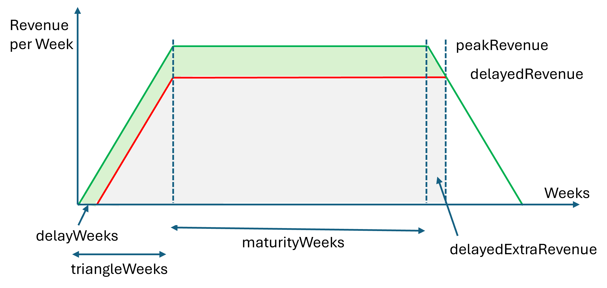
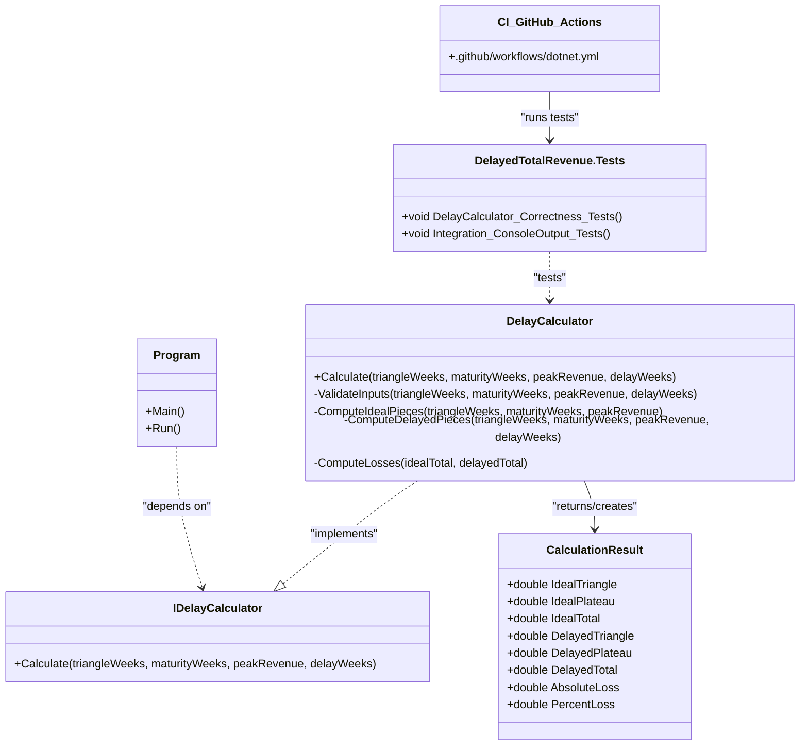

# Delayed Total Revenue

## Motivation

This project calculates the total revenue of a product sold on the market in an:  
- ideal case (no delay in development)  
- delayed case (delay in development)

to showcase what impact deficiencies in the product, or in the product documentation (for a medical device) have when regulatory bodies reject market clearance.

## Input and Output  

Input to the software is:
1. Length of the ramp-up time period (in weeks)  
2. Length of the maturity plateau time period (in weeks)
3. Peak revenue (in units of currency/week)  
4. Delay (in weeks)  

Output to the software is:  
1. Total lifetime revenue of ideal case  
2. Total lifetime revenue of delayed case  
3. Absolute loss as a result of the delay  
4. Relative loss as a result of the delay (in %)  

## Schematic Drawing




## Technical Description  

The code was written in C# 13 and .NET 9.0, and implemented as a command-line application.

## Architecture overview

The following class diagram shows the core components:



### Components and Responsibilities  
- Program - CLI entry point; orchestrates input/output and calls the calculator  
- ```IDelayCalculator``` - abstraction for calculation operations (enables substitution and testing).  
- ```DelayCalculator``` - concrete logic: input validation and calculation helpers (```ComputeIdealPieces```, ```ComputeDelayedPieces```, ```ComputeLosses```)  
- ```CalculationResult``` - immutable Data Transfer Object (DTO) that carries computation outputs  
- ```DelayedTotalRevenue.Tests``` - unit and integration tests (exercise ```DelayCalculator``` and ```Program```)
- ```.github/workflows/dotnet.yml``` - CI pipeline that builds and runs tests.  

### How this Reflects Clean‑Code (SOLID) Principles  
SOLID design principles in C# are basic design principles. SOLID stands for **S**ingle Responsibility Principle (SRP), **O**pen closed Principle (OSP), **L**iskov substitution Principle (LSP), **I**nterface Segregation Principle (ISP), and **D**ependency Inversion Principle (DIP). 
Robert C. Martin compiled these principles in the 1990s, and published them in the great book "Clean Code" [1]. These principles provide us with ways to move from tightly coupled code and little encapsulation to the desired results of loosely coupled and encapsulated real business needs properly.  
#### Single Responsibility Principle  
Each class has one focused role (```DelayCalculator``` does calculations; ```CalculationResult``` only holds data; ```Program``` handles I/O).  
#### Open Closed Principle (OSP)
```IDelayCalculator``` lets new implementations be added without modifying callers.  
#### Liskov substitution Principle (LSP)  
The abstraction (```IDelayCalculator```) is paired with a concrete ```DelayCalculator``` that adheres to the interface contract (same signature, documented preconditions/exceptions, and consistent return semantics).  
#### Interface Segregation Principle (ISP)
This principle is fulfilled by exposing a narrow ```IDelayCalculator``` interface with only the ```Calculate(...)``` contract while keeping validation and helper methods private inside ```DelayCalculator```, so callers depend only on the minimal API they need.
#### Dependency Inversion 
High‑level code depends on the ```IDelayCalculator``` abstraction, not the concrete ```DelayCalculator```.  
#### Small, focused methods 
```ValidateInputs```, ```ComputeIdealPieces```, ```ComputeDelayedPieces```, ```ComputeLosses``` improve readability and testability.  
#### Other items improving the cod equality  
##### Readability & naming  
Descriptive names and XML docs make intent explicit; public API documented via summaries and <param> tags.  
##### Testability 
Logic is decoupled from Console so unit tests can exercise behavior in isolation; integration tests capture Console.Out when needed.  
##### Fail‑fast validation  
```ValidateInputs``` enforces preconditions consistently.  
### Test-driven development  
#### Non‑breaking option to extend by adding functionality through test-driven development: 
The idea is to first write a unit test that defines the input and expected output e.g. for the impact of a product recall on the total revenue. The run the test and have it fail. Next, add a dedicated method on ```DelayCalculator``` (e.g., ```CalculateWithRecall(...)```) and run the unit test; keep ```IDelayCalculator``` unchanged.  
#### Alternative (if recall must be part of public contract)  
Add an overload to ```IDelayCalculator``` and update implementations.  
#### How to plan testing  
Add tests in ```DelayedTotalRevenue.Tests```, run locally via ```dotnet test```, then CI will validate on push. It is important to keep public API stable, Hence, prefer new methods over changing existing signatures. Add a unit test per behavioral change and a small integration test when the CLI is extended.  
#### Documentation (README + Mermaid)  
Keep documentation close to the code so architecture and intent remain synchronized.