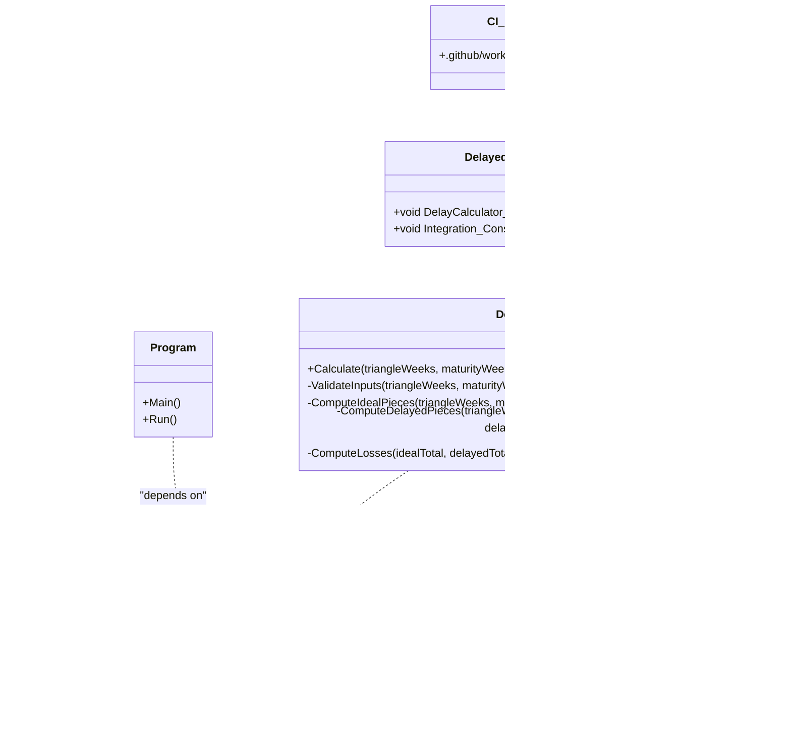

# Delayed Total Revenue

This project calculates delayed revenue based on various input parameters.

## Architecture overview

The following class diagram shows the core components:

```mermaid

classDiagram
class Program {
  +Main()
  +Run()
}

class IDelayCalculator {
  +Calculate(triangleWeeks, maturityWeeks, peakRevenue, delayWeeks)
}

class DelayCalculator {
  +Calculate(triangleWeeks, maturityWeeks, peakRevenue, delayWeeks)
  -ValidateInputs(triangleWeeks, maturityWeeks, peakRevenue, delayWeeks)
  -ComputeIdealPieces(triangleWeeks, maturityWeeks, peakRevenue)
  -ComputeDelayedPieces(triangleWeeks, maturityWeeks, peakRevenue, delayWeeks)
  -ComputeLosses(idealTotal, delayedTotal)
}

class CalculationResult {
  +double IdealTriangle
  +double IdealPlateau
  +double IdealTotal
  +double DelayedTriangle
  +double DelayedPlateau
  +double DelayedTotal
  +double AbsoluteLoss
  +double PercentLoss
}

class DelayedTotalRevenue.Tests {
  +void DelayCalculator_Correctness_Tests()
  +void Integration_ConsoleOutput_Tests()
}

class CI_GitHub_Actions {
  +.github/workflows/dotnet.yml
}

Program ..> IDelayCalculator : "depends on"
DelayCalculator ..|> IDelayCalculator : "implements"
DelayCalculator --> CalculationResult : "returns/creates"
DelayedTotalRevenue.Tests ..> DelayCalculator : "tests"
CI_GitHub_Actions --> DelayedTotalRevenue.Tests : "runs tests"

```